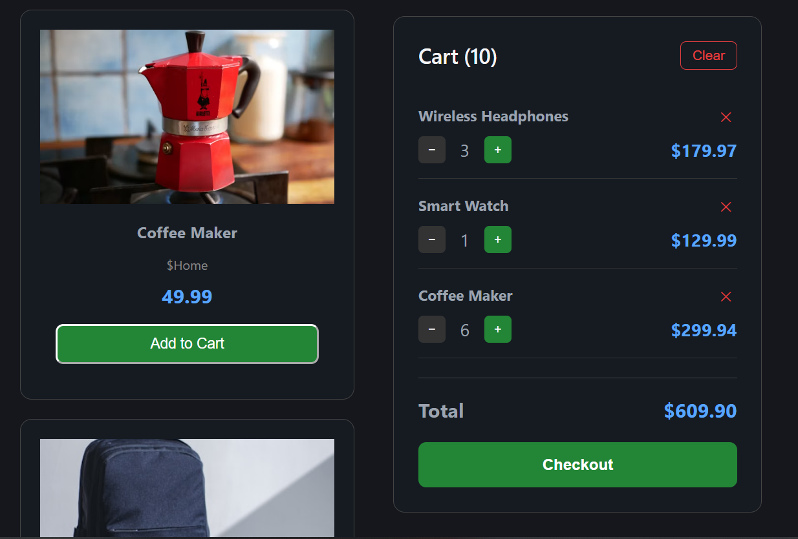
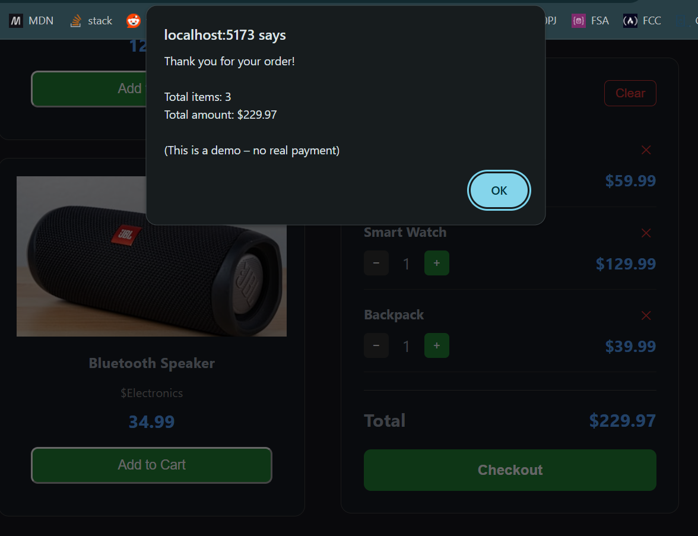

# React Shopping Cart

A modern shopping cart application built with React + Vite.

## Live Demo

https://agmyathtun.github.io/react-shopping-cart/

## Features

- Product listing with images
- Real-time search filter
- Add to cart with quantity control (+ / −)
- Remove items and clear cart
- Sticky cart sidebar
- Checkout functionality
- Cart data saved in localStorage (persists after refresh)
- Fully responsive design

## Tech Stack

- React 18
- Vite
- useState + useEffect
- LocalStorage
- Component composition (props)
- GitHub Pages deployment

## Screenshots

### Product List + Search


### Cart Sidebar



### Checkout



## How to Run Locally

```bash
git clone https://github.com/Agmyathtun/react-shopping-cart.git
cd react-shopping-cart
npm install
npm run dev

## License
MIT
```
